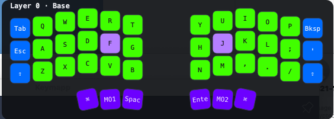

# Desktop HUD

A real-time overlay of the active keymap layer on a [Halcyon Corne](https://splitkb.com/products/halcyon-corne), similar in spirit to ZSA's Keymapp — but reading live layer/key state directly off the keyboard over USB HID rather than showing a static keymap.



## How it works

The `mak3r` keymap in [`halcyon-corne`](https://github.com/mak3r/halcyon-corne) broadcasts the active layer number and individual keystrokes over QMK's `CONSOLE_ENABLE` USB HID interface (see that repo's `hud_console.c` and `CLAUDE.md`) — deliberately a *separate* interface from VIA/Vial's own raw HID channel, confirmed on hardware to keep vial.rocks working normally while this is also connected. This app listens on that interface and shows a small always-on-top overlay of the current layer's keys, colored to match the real keyboard's RGB, with the key currently being pressed outlined.

```
firmware (layer_state_set_user / process_record_user)
  -> CONSOLE_ENABLE USB HID interface ("LAYER:<n>\n" / "KEY:<row>,<col>,<0|1>\n" text lines)
    -> hid_transport.py (background QThread, auto-reconnects)
      -> hud_window.py (paints the overlay, draggable, remembers its position)
```

## Version compatibility

The two repos are tightly coupled — this app can only show what the firmware actually broadcasts, so an older firmware build won't have data a newer HUD app version expects. Check this table before pairing a specific release of each:

| `corne-kbd-hud` | requires `halcyon-corne` | why |
|---|---|---|
| [v0.1.0](https://github.com/mak3r/corne-kbd-hud/releases/tag/v0.1.0) | [v0.1.0-mak3r](https://github.com/mak3r/halcyon-corne/releases/tag/v0.1.0-mak3r) or later | `v0.1.0-mak3r` is the first firmware release broadcasting `KEY:` (per-keystroke) messages, which this HUD version relies on for its press-highlight feature — older `mak3r` builds only sent `LAYER:`. |

*(Keep this table's rows in sync with the identical copy in `halcyon-corne`'s own `docs/HUD.md` whenever a new paired release goes out on either side.)*

Running this app against older firmware than its table row lists won't crash anything — unrecognized message types are just ignored — but any feature that depends on a newer broadcast (e.g. per-key highlighting) silently won't work until the keyboard is reflashed.

## Running it

```bash
python3 -m venv .venv
source .venv/bin/activate
pip install PySide6 hid
python3 -m corne_kbd_hud   # (with src/ on PYTHONPATH, or `pip install -e .` first)
```

On macOS, `hid` needs the native `hidapi` library — `brew install hidapi` if the import fails. The first time it opens the keyboard's HID interface, macOS may prompt for **Input Monitoring** permission (System Settings → Privacy & Security).

A tray icon appears in the menu bar (a filled teal dot = keyboard connected, a terracotta ring = not) — look at the far right of the menu bar on a wide/multi-monitor setup, since macOS only ever places status icons on the primary display's menu bar. Its menu toggles "Pin HUD Visible" and quits the app.

The HUD itself:
- Auto-shows when you leave the base layer and auto-hides ~1.5s after returning to it, unless pinned.
- Is movable — click and drag it anywhere; the position is remembered across restarts.
- Highlights each key with a white outline while it's physically held down — a visual checkpoint while learning a new layout.
- Stays visible across every macOS Space/virtual desktop, including over apps in native full-screen mode — the same `NSWindowCollectionBehavior` technique apps like Keymapp use (see `hud_window.py`'s `_set_collection_behavior_all_spaces()`).

## Regenerating the keymap/color data

`src/corne_kbd_hud/data/mak3r_layers.json` (keycodes + real per-key colors) is generated from `halcyon-corne`'s own sources, not hand-maintained — this includes colors from the [Corne Palette Editor](PALETTE_EDITOR.md):

```bash
python3 scripts/generate_layout_data.py \
    --vil ~/projects/halcyon/corne-vial/mak3rs.vil \
    --csv ~/projects/halcyon-corne/keyboards/splitkb/halcyon/corne/keymaps/mak3r/rgb_layers.csv
```

Run this after editing the keymap or colors over there, then commit the regenerated JSON here.

## Building and deploying (macOS)

Verified working end-to-end (Briefcase 0.4.5): `briefcase build` produces a real, launchable `.app`.

```bash
python3 -m pip install --break-system-packages briefcase   # or install into a venv instead
briefcase build
```

This builds `build/corne_kbd_hud/macos/app/Corne HUD.app`, ad-hoc signed (no Apple Developer account needed for this). To run it:

```bash
open "build/corne_kbd_hud/macos/app/Corne HUD.app"
```

Or drag/copy that `.app` into `/Applications` to launch it like any normally installed app (from Spotlight/Launchpad) — it won't show up in the Dock, by design (see `app.py`'s `_hide_from_dock()`), only as the tray icon. **After every rebuild**, re-copy it over the `/Applications` copy — `briefcase build` only updates the one under `build/`, so the deployed copy goes stale otherwise.

The first launch after a fresh rebuild may show a **"Corne HUD would like to receive keystrokes from any application"** system prompt (Input Monitoring) — click **Open System Settings** and enable it, then quit and reopen the app for the grant to take effect. Because the app is only ad-hoc signed (no paid Apple Developer account), macOS treats each fresh build as a new app for permission purposes, so this can recur after rebuilds.

**Gotchas already handled in this repo's code** (see `CLAUDE.md`'s "Packaging notes" for the full detail if this ever breaks):
- Briefcase requires a PEP 639 `license`/`license-files` declaration or it refuses to build at all.
- PySide6's macOS wheel needs `min_os_version = "13.0"` — Briefcase's default of `11.0` makes pip reject it with a confusing "no matching distribution" error.
- If a build fails partway through and a later `briefcase build` finishes suspiciously fast, it may have silently skipped reinstalling requirements against a broken cached environment — force a clean rebuild with `rm -rf build .briefcase`.
- The packaged app can't find Homebrew's native `hid` library by default (shows permanently "disconnected") — `hid_transport.py` works around this by loading it explicitly rather than relying on the OS's default search.

**Not set up / not needed for personal use**: `briefcase package` (a distributable signed `.dmg`/`.pkg`) requires an active Apple Developer Program membership ($99/year) for a Developer ID certificate + notarization — irrelevant unless you're planning to hand the built app to someone else to run on their own Mac. A locally-built, ad-hoc-signed `.app` like the one above runs fine on the machine that built it, since Gatekeeper's strict signature/notarization check only triggers on files carrying the "downloaded from the internet" quarantine flag.

Linux (and Windows) builds are deferred — see the README's Status section.
