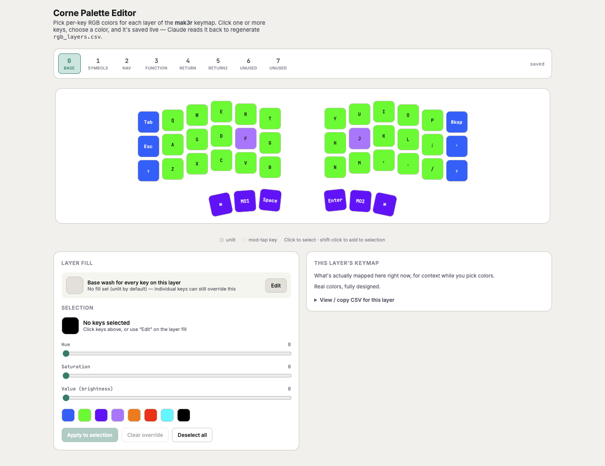

# Corne Palette Editor

The **Corne Palette Editor** is an interactive per-key/per-layer RGB color picker for the Halcyon Corne — matching its actual physical layout (column stagger, thumb clusters, both halves) — used to design the colors this HUD app renders.

It's not part of this repo: its source and full documentation live in [`halcyon-corne`](https://github.com/mak3r/halcyon-corne), the firmware repo, since VialRGB has no per-key/per-layer color UI of its own and this fills that gap for editing the firmware's compiled `ledmap.c`. See that repo's **[docs/PALETTE_EDITOR.md](https://github.com/mak3r/halcyon-corne/blob/main/docs/PALETTE_EDITOR.md)** for how to open and use it.

## Why it's relevant here

This app doesn't read colors live from the keyboard — it renders from `src/corne_kbd_hud/data/mak3r_layers.json`, generated from `halcyon-corne`'s `rgb_layers.csv` (the same file the palette editor writes to). After picking new colors there, regenerate this repo's copy of the data — see [docs/HUD.md](HUD.md#regenerating-the-keymapcolor-data) — and commit the result here, or this app's colors will drift out of sync with what's actually on the keyboard.
